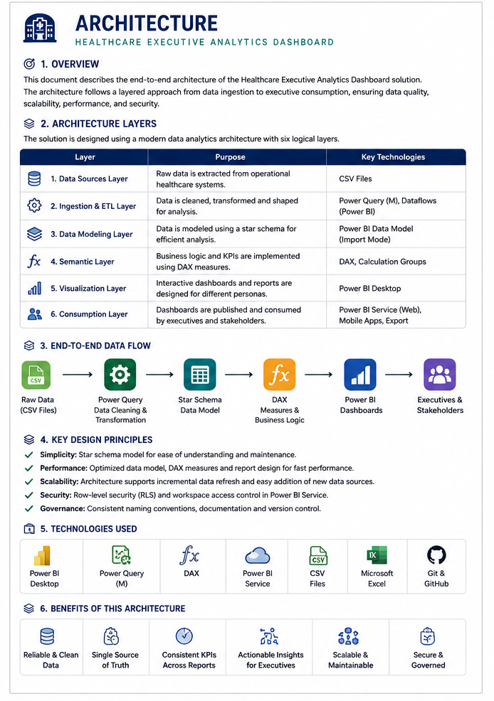

# 🏥 Healthcare Executive Analytics Dashboard

# 🏗️ Solution Architecture

> **Enterprise Power BI Architecture for Executive Healthcare Analytics**

---

## 📖 Overview

The **Healthcare Executive Analytics Dashboard** is an enterprise-grade Business Intelligence solution developed using **Microsoft Power BI**, following modern BI architecture principles. The solution transforms raw healthcare operational data into executive-ready insights through a structured pipeline consisting of **Data Ingestion**, **ETL**, **Star Schema Data Modeling**, **DAX Semantic Modeling**, and **Interactive Reporting**.

The architecture emphasizes **performance**, **scalability**, **maintainability**, and **executive decision support**, enabling healthcare organizations to monitor patient experience, clinical outcomes, financial performance, and operational efficiency from a unified analytics platform.

---

# 🖼️ Solution Architecture Diagram

> **Figure 1. End-to-End Solution Architecture**

<p align="center">

</p>

---

# 🎯 Architecture at a Glance

| Layer             | Technology           | Purpose                         |
| ----------------- | -------------------- | ------------------------------- |
| 📥 Data Source    | CSV Dataset          | Healthcare operational data     |
| 🔄 ETL            | Power Query (M)      | Data cleansing & transformation |
| 🗄️ Data Model    | Star Schema          | Optimized analytical model      |
| 🧠 Semantic Layer | DAX                  | Business calculations & KPIs    |
| 📊 Reporting      | Power BI Desktop     | Interactive dashboards          |
| 💼 Consumption    | Executive Leadership | Strategic decision making       |

---

# 🚀 End-to-End Data Flow

```text
┌──────────────────────────────────────────────────────────────┐
│                    DATA SOURCE LAYER                         │
└──────────────────────────────────────────────────────────────┘
                  Healthcare CSV Dataset
                           │
                           ▼
┌──────────────────────────────────────────────────────────────┐
│                  POWER QUERY (ETL)                           │
├──────────────────────────────────────────────────────────────┤
│ ✔ Import Dataset                                             │
│ ✔ Data Type Validation                                       │
│ ✔ Remove Duplicates                                          │
│ ✔ Handle Missing Values                                      │
│ ✔ Business Transformations                                   │
│ ✔ Derived Columns                                            │
└──────────────────────────────────────────────────────────────┘
                           │
                           ▼
┌──────────────────────────────────────────────────────────────┐
│                STAR SCHEMA DATA MODEL                        │
├──────────────────────────────────────────────────────────────┤
│                      DateTable                              │
│                          │                                  │
│                          │ 1                                │
│                          ▼                                  │
│                    HealthcareData                           │
└──────────────────────────────────────────────────────────────┘
                           │
                           ▼
┌──────────────────────────────────────────────────────────────┐
│                 DAX SEMANTIC LAYER                           │
├──────────────────────────────────────────────────────────────┤
│ Executive KPIs                                               │
│ Financial KPIs                                               │
│ Clinical KPIs                                                │
│ Operational KPIs                                             │
│ Time Intelligence                                            │
│ Dynamic Executive Insights                                   │
└──────────────────────────────────────────────────────────────┘
                           │
                           ▼
┌──────────────────────────────────────────────────────────────┐
│                POWER BI REPORTING                            │
├──────────────────────────────────────────────────────────────┤
│ Executive Overview                                           │
│ Patient Experience                                           │
│ Clinical Analytics                                           │
│ Financial Analytics                                          │
│ Operational Analytics                                        │
│ Executive Insights                                           │
└──────────────────────────────────────────────────────────────┘
                           │
                           ▼
              Executive Decision Support & Insights
```

---

# 🏛️ Architecture Layers

---

<details>
<summary><strong>📥 1. Data Source Layer</strong></summary>

## Purpose

Provides the raw healthcare operational data required for reporting and analysis.

### Data Source

* Healthcare CSV Dataset

### Key Business Attributes

* Patient ID
* Date of Visit
* Department
* Diagnosis Category
* Insurance Provider
* Visit Type
* Admission Status
* Treatment Cost
* Wait Time
* Patient Satisfaction
* Gender
* Age
* Race

### Outcome

A centralized dataset serving as the foundation for enterprise analytics.

</details>

---

<details>
<summary><strong>🔄 2. ETL Layer (Power Query)</strong></summary>

## Technology

**Microsoft Power Query (M Language)**

### Responsibilities

* Import source dataset
* Remove duplicate records
* Handle null values
* Standardize data types
* Rename columns
* Create business-friendly fields
* Prepare analytical dataset

### Business Benefits

* Improved data quality
* Consistent reporting
* Reduced manual effort
* Reusable transformation pipeline

</details>

---

<details>
<summary><strong>🗄️ 3. Data Modeling Layer</strong></summary>

## Modeling Approach

⭐ **Star Schema**

### Fact Table

**HealthcareData**

Contains transactional healthcare records including:

* Patient Visits
* Revenue
* Wait Time
* Satisfaction Score
* Admission Details

### Dimension Table

**DateTable**

Supports enterprise time intelligence with:

* Year
* Quarter
* Month
* Month Number
* Week
* Day

### Why Star Schema?

* Faster report performance
* Simplified relationships
* Easier DAX calculations
* Better scalability
* Industry best practice

</details>

---

<details>
<summary><strong>🧠 4. Semantic Layer (DAX)</strong></summary>

## Business Logic

The semantic layer converts raw data into business-ready metrics using **Data Analysis Expressions (DAX)**.

### KPI Categories

#### Executive KPIs

* Total Patients
* Total Visits
* Admission Rate
* Average Satisfaction
* Average Wait Time

#### Financial KPIs

* Total Revenue
* Revenue Per Patient
* Average Revenue Per Visit

#### Clinical KPIs

* Department Performance
* Diagnosis Distribution
* Admission Analysis

#### Operational KPIs

* Emergency Visits
* Ambulance Visits
* Observation Patients
* Wait Categories

### Time Intelligence

Implemented using:

* `CALCULATE()`
* `SAMEPERIODLASTYEAR()`
* `FILTER()`
* `DIVIDE()`
* `SWITCH()`
* `RANKX()`
* `FORMAT()`

These enable:

* Previous Year Comparison
* Year-over-Year Growth
* Dynamic Rankings
* Executive KPI Cards
* AI-style Narrative Insights

</details>

---

<details>
<summary><strong>📊 5. Reporting Layer</strong></summary>

The reporting layer is built using **Microsoft Power BI Desktop**, following modern executive dashboard design principles.

### Dashboard Pages

| Page                     | Purpose                                       |
| ------------------------ | --------------------------------------------- |
| 🏠 Executive Overview    | Executive KPI Summary                         |
| 😊 Patient Experience    | Satisfaction & Wait Time Analysis             |
| 🩺 Clinical Analytics    | Clinical Performance Insights                 |
| 💰 Financial Analytics   | Revenue & Cost Analysis                       |
| ⚙️ Operational Analytics | Operational Performance Monitoring            |
| 💡 Executive Insights    | Dynamic Business Narratives & Recommendations |

### Design Principles

* Executive-first layout
* Minimal visual clutter
* Interactive navigation
* Consistent branding
* Responsive filtering
* High information density

</details>

---

<details>
<summary><strong>💼 6. Business Consumption Layer</strong></summary>

The final layer delivers actionable intelligence to healthcare leadership.

### Primary Users

* Executive Leadership
* Hospital Administrators
* Finance Teams
* Clinical Managers
* Operational Leaders

### Business Outcomes

* Improved patient experience
* Better operational visibility
* Enhanced financial monitoring
* Data-driven clinical decisions
* Executive performance tracking

</details>

---

# ⚡ Performance Optimization

The solution incorporates enterprise BI optimization techniques.

| Optimization                  | Benefit                     |
| ----------------------------- | --------------------------- |
| ⭐ Star Schema                 | Faster query execution      |
| 📅 Date Dimension             | Efficient time intelligence |
| 🧠 Reusable DAX Measures      | Reduced model complexity    |
| 📊 Optimized Visuals          | Improved rendering speed    |
| 🔍 Efficient Relationships    | Better filter propagation   |
| 📈 Minimal Calculated Columns | Lower memory consumption    |

---

# 🔒 Security & Governance

| Feature                        | Status |
| ------------------------------ | ------ |
| Row-Level Security (RLS) Ready | ✅      |
| Standard Naming Conventions    | ✅      |
| Reusable Measure Library       | ✅      |
| GitHub Version Control         | ✅      |
| Modular Documentation          | ✅      |
| Enterprise Folder Structure    | ✅      |

---

# 🛠️ Technology Stack

| Technology                 | Purpose                         |
| -------------------------- | ------------------------------- |
| Microsoft Power BI Desktop | Dashboard Development           |
| Power Query (M)            | Data Transformation             |
| DAX                        | Business Calculations           |
| Star Schema                | Data Modeling                   |
| CSV Dataset                | Data Source                     |
| Git & GitHub               | Version Control & Documentation |

---

# 🌟 Business Value

This solution enables healthcare organizations to transform operational data into meaningful executive intelligence.

### Key Benefits

* Executive-ready KPI reporting
* Improved patient experience monitoring
* Financial performance visibility
* Clinical outcome analysis
* Operational efficiency tracking
* Standardized business metrics
* Scalable analytics architecture

---

# 🚀 Future Roadmap

```text
Current Solution
│
├── Power BI Desktop
├── Power Query
├── DAX
├── Star Schema
│
└──────────────► Future Enhancements

        Microsoft Fabric
                │
        Direct Lake
                │
        Incremental Refresh
                │
        AI-Assisted Insights
                │
        Copilot for Power BI
                │
        Real-Time Healthcare Analytics
```

---

# 📌 Key Design Principles

The architecture was designed around the following principles:

* Simplicity over complexity
* Performance-first data modeling
* Reusable business logic
* Executive-focused reporting
* Scalable architecture
* Consistent user experience
* Maintainable documentation
* Industry best practices

---

# 📖 Conclusion

The **Healthcare Executive Analytics Dashboard** demonstrates a modern enterprise Business Intelligence architecture that combines **Power Query**, **Star Schema Data Modeling**, **DAX**, and **Power BI** to deliver executive-ready healthcare analytics.

By following industry-standard architecture patterns and BI best practices, the solution provides a scalable, maintainable, and high-performance analytics platform that empowers healthcare leaders to make informed, data-driven decisions across patient experience, clinical performance, financial management, and operational efficiency.

---

## 📚 Related Documentation

* 📄 `README.md`
* 📄 `Documentation/DATA_MODEL.md`
* 📄 `Documentation/DAX_MEASURES.md`
* 📄 `Documentation/DESIGN_GUIDELINES.md`
* 📄 `Documentation/DEPLOYMENT_GUIDE.md`
