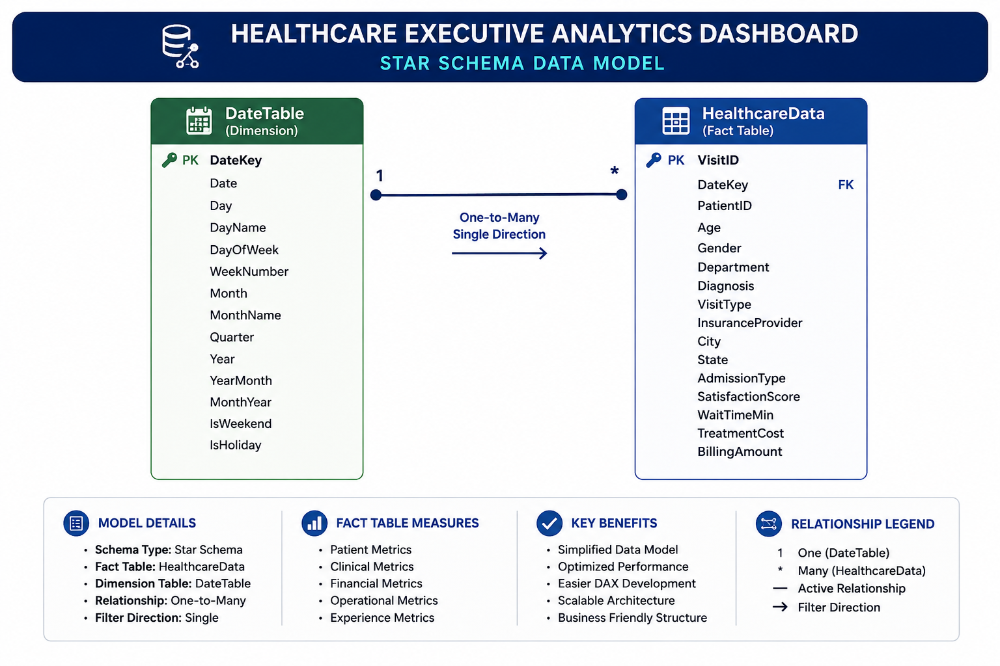

# 🗄️ Data Model Design

> **Healthcare Executive Analytics Dashboard**
> Enterprise Star Schema Data Model Documentation

---

# 📖 Overview

The **Healthcare Executive Analytics Dashboard** is built on a **Star Schema**, the industry-standard dimensional modeling approach used in enterprise Business Intelligence solutions.

The model separates **transactional data** from **analytical dimensions**, enabling faster query performance, simplified DAX calculations, and improved scalability.

The design follows Microsoft Power BI best practices for semantic modeling and supports interactive filtering, time intelligence, and executive-level reporting.

---

# 🖼️ Data Model Diagram

> **Figure 1. Star Schema Data Model**

<p align="center">

</p>

---

# ⭐ Why Star Schema?

A **Star Schema** organizes data into a central **Fact Table** connected to one or more **Dimension Tables**.

```text
               DateTable
                   │
                   │ 1
                   ▼
          HealthcareData
```

### Benefits

* Faster query execution
* Simplified DAX calculations
* Reduced model complexity
* Improved report performance
* Easy scalability
* Industry-standard BI architecture

---

# 📊 Model Overview

| Component         | Description      |
| ----------------- | ---------------- |
| Fact Tables       | 1                |
| Dimension Tables  | 1                |
| Relationships     | 1                |
| Relationship Type | One-to-Many      |
| Cross Filter      | Single Direction |
| Storage Mode      | Import           |
| Modeling Pattern  | Star Schema      |

---

# 🧱 Model Architecture

```text
┌───────────────────────────────────────────┐
│              DateTable                     │
├───────────────────────────────────────────┤
│ Date                                      │
│ Year                                      │
│ Quarter                                   │
│ Month                                     │
│ Month Number                              │
│ Month Name                                │
│ Week                                      │
│ Day                                       │
└───────────────────────────────────────────┘
                  │
                  │ 1
                  ▼
┌───────────────────────────────────────────┐
│            HealthcareData                 │
├───────────────────────────────────────────┤
│ Patient ID                                │
│ DateKey                                   │
│ Department Referral                       │
│ Diagnosis Category                        │
│ Insurance Provider                        │
│ Visit Type                                │
│ Admission Flag                            │
│ Gender                                    │
│ Race                                      │
│ Age                                       │
│ Treatment Cost                            │
│ Wait Time                                 │
│ Patient Satisfaction                      │
└───────────────────────────────────────────┘
```

---

# 📋 Fact Table

<details>
<summary><strong>🏥 HealthcareData</strong></summary>

The **HealthcareData** table is the central fact table containing transactional healthcare records.

### Primary Purpose

Stores detailed patient visit information used to calculate all dashboard KPIs.

### Key Business Domains

* Patient Demographics
* Clinical Information
* Financial Information
* Operational Metrics
* Satisfaction Metrics

### Example Columns

| Column               | Description                             |
| -------------------- | --------------------------------------- |
| Patient ID           | Unique patient identifier               |
| DateKey              | Foreign key to DateTable                |
| Department Referral  | Clinical department                     |
| Diagnosis Category   | Diagnosis classification                |
| Insurance Provider   | Patient insurance                       |
| Visit Type           | Emergency, Walk-In, Referral, Ambulance |
| Treatment Cost       | Revenue generated                       |
| Wait Time            | Patient waiting duration                |
| Patient Satisfaction | Satisfaction score                      |
| Gender               | Patient gender                          |
| Race                 | Patient race                            |
| Age                  | Patient age                             |

</details>

---

# 📅 Dimension Table

<details>
<summary><strong>📆 DateTable</strong></summary>

The **DateTable** provides a centralized calendar for all time-based analytics.

### Purpose

Supports enterprise time intelligence calculations.

### Key Attributes

| Column       | Purpose             |
| ------------ | ------------------- |
| Date         | Relationship key    |
| Year         | Annual analysis     |
| Quarter      | Quarterly reporting |
| Month        | Monthly reporting   |
| Month Number | Sorting             |
| Month Name   | Display             |
| Week         | Weekly analysis     |
| Day          | Daily reporting     |

### Business Benefits

* Consistent date filtering
* Previous year analysis
* Time intelligence
* Monthly trends
* Fiscal reporting (future-ready)

</details>

---

# 🔗 Relationships

The model contains a single relationship between the Date Dimension and the Fact Table.

| Property         | Value                   |
| ---------------- | ----------------------- |
| From             | DateTable[Date]         |
| To               | HealthcareData[DateKey] |
| Cardinality      | One-to-Many (1:*)       |
| Filter Direction | Single                  |
| Relationship     | Active                  |

### Why Single Direction?

* Better performance
* Prevents ambiguous filter paths
* Simplifies DAX
* Microsoft best practice

---

# 📐 Data Modeling Principles

The model follows modern dimensional modeling standards.

### Design Decisions

* ✅ Star Schema
* ✅ Single Fact Table
* ✅ Shared Date Dimension
* ✅ Single Active Relationship
* ✅ Measures instead of Calculated Columns where possible
* ✅ Optimized for Import Mode
* ✅ Time Intelligence Ready

---

# 📈 Measure Organization

Measures are grouped by business domain to improve maintainability.

| Category           | Examples                            |
| ------------------ | ----------------------------------- |
| Executive KPIs     | Total Patients, Total Visits        |
| Financial KPIs     | Total Revenue, Revenue Per Patient  |
| Clinical KPIs      | Diagnosis Distribution              |
| Patient Experience | Avg Satisfaction, Avg Wait Time     |
| Operational KPIs   | Emergency Visits, Observation Count |
| Time Intelligence  | Previous Year, YoY Growth           |
| Executive Insights | Dynamic Narrative Measures          |

---

# 🧠 Time Intelligence Strategy

The dashboard uses a dedicated Date Dimension with DAX time intelligence functions.

### Key Functions

* `CALCULATE()`
* `SAMEPERIODLASTYEAR()`
* `DATEADD()`
* `DIVIDE()`
* `FILTER()`

### Supported Analysis

* Year-over-Year Comparison
* Monthly Trends
* Annual KPIs
* Dynamic Date Filtering

---

# ⚡ Performance Optimization

The data model has been optimized for analytical performance.

| Optimization             | Benefit                     |
| ------------------------ | --------------------------- |
| Import Mode              | Faster query execution      |
| Star Schema              | Simplified relationships    |
| Single Direction Filters | Reduced ambiguity           |
| Reusable Measures        | Lower maintenance           |
| Dedicated Date Table     | Efficient time intelligence |
| Optimized Data Types     | Reduced memory usage        |

---

# 🏷️ Naming Conventions

To maintain consistency, the following naming standards are used.

### Tables

* PascalCase
* Singular names where appropriate

Examples:

* `HealthcareData`
* `DateTable`

### Measures

Business-friendly names enclosed in brackets.

Examples:

* `[Total Patients]`
* `[Total Revenue]`
* `[Avg Satisfaction]`

### Columns

Readable business names.

Examples:

* `Department Referral`
* `Diagnosis Category`
* `Insurance Provider`

---

# 🚀 Scalability

The model is designed to support future enhancements, including:

* Additional dimension tables (Hospital, Physician, Location)
* Incremental Refresh
* Microsoft Fabric
* Direct Lake
* Row-Level Security (RLS)
* Composite Models
* Real-Time Data Sources

---

# 💼 Business Value

The data model provides a robust analytical foundation that enables:

* Executive KPI reporting
* Clinical performance monitoring
* Financial analysis
* Operational efficiency tracking
* Interactive filtering
* Reliable year-over-year comparisons
* Scalable healthcare analytics

---

# 📌 Best Practices Followed

* ⭐ Star Schema Modeling
* 📅 Dedicated Date Dimension
* 📈 Measure-Driven Calculations
* ⚡ Import Mode Optimization
* 🔄 Reusable DAX Measures
* 🧹 Clean Naming Standards
* 🔍 Single Direction Relationships
* 📊 Semantic Layer Design

---

# 📚 Related Documentation

* 📄 `README.md`
* 📄 `Documentation/ARCHITECTURE.md`
* 📄 `Documentation/DAX_MEASURES.md`
* 📄 `Documentation/DESIGN_GUIDELINES.md`
* 📄 `Documentation/DEPLOYMENT_GUIDE.md`

---

# 🏁 Conclusion

The **Healthcare Executive Analytics Dashboard** is built upon a clean, scalable, and high-performance **Star Schema** that aligns with modern Business Intelligence and data warehousing best practices.

By separating transactional healthcare data from analytical dimensions and leveraging reusable DAX measures, the model delivers a robust semantic layer that supports executive reporting, advanced analytics, and future scalability while maintaining excellent performance and maintainability.
